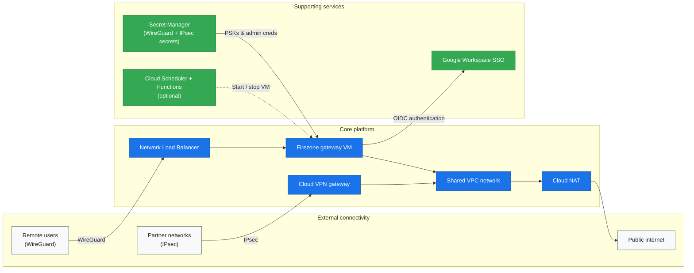

# terraform-gcp-vpn

[](https://github.com/dieguezz/terraform-gcp-vpn/actions/workflows/ci.yml)
[](https://securityscorecards.dev/viewer/?uri=github.com/dieguezz/terraform-gcp-vpn)
[](LICENSE)


Production-ready WireGuard VPN on Google Cloud, powered by Terraform. Launch Firezone remote access plus optional site-to-site IPsec in minutes.


## Core capabilities

- Firezone + WireGuard remote access with Google OAuth ready to configure.
- Classic Cloud VPN tunnels for partner connectivity alongside remote users.
- Hardened defaults: shielded VM, OS Login via IAP, explicit firewall policy, optional CMEK.
- Runtime secrets pulled from Secret Manager; no credentials stored in terraform state.
- Optional auto start/stop scheduling to park non-production environments.

## What's included

| Component | Description |
|-----------|-------------|
| `modules/network` | Shared VPC, subnets, Cloud NAT, static IPs. |
| `modules/compute` | Firezone VM with shielded images and CMEK-ready disks. |
| `modules/security` | Firewall rules, IAM bindings, OS Login settings. |
| `modules/load-balancer` | Regional network load balancer fronting WireGuard. |
| `modules/vpn-gateway` | Classic VPN gateway + tunnels for site-to-site IPsec. |
| `modules/scheduler` | Cloud Scheduler + Cloud Functions for start/stop automation. |

## Architecture at a glance



## Quick start

### Prerequisites
- Terraform ≥ 1.6.0.
- Google Cloud project with billing enabled and `gcloud` authenticated.
- Service account (or ADC) with permissions for compute, networking, Secret Manager.
- Domain + SSL cert for the Firezone dashboard (optional but recommended).

### Deploy in three steps
```bash
git clone https://github.com/dieguezz/terraform-gcp-vpn.git
cd terraform-gcp-vpn
cp terraform.tfvars.example terraform.tfvars
# update terraform.tfvars with your project settings
terraform init
terraform apply
```

## Configuration essentials

| Variable | What it controls | Default |
|----------|-----------------|---------|
| `project_id` | Target GCP project | n/a |
| `region` | Primary region for resources | `europe-southwest1` |
| `firezone_domain` | Public hostname for Firezone | n/a |
| `enable_site_to_site_vpn` | Toggle Classic VPN gateway + tunnels | `false` |
| `enable_scheduling` | Enable auto start/stop via Cloud Scheduler | `false` |

See [`terraform.tfvars.example`](terraform.tfvars.example) for the full catalog of inputs.

## Secure by default

- Private VM with Identity-Aware Proxy and OS Login; no public SSH.
- Optional Customer-Managed Encryption Keys for disks and bucket assets.
- Strict firewall rules and egress allow-list support.
- Secrets retrieved at runtime from Google Secret Manager only.

## Operations quick links

- `Makefile` targets for status checks (`make instance-status`, `make vpn-tunnel-status PARTNER=<name>`, etc.).
- `scripts/site-to-site/` templates to verify each partner tunnel.
- [`docs/incident-response.md`](docs/incident-response.md) runbook for on-call playbooks and alert testing.
- `modules/scheduler/` README for enabling cost-saving automation.
- [`SUPPORT.md`](SUPPORT.md) for commercial support and contact channels.

## Next steps

- Customize branding and OAuth in Firezone once the stack is live.
- Duplicate the `modules/vpn-gateway` example to onboard partners quickly.
- Add observability dashboards and configure remote state backend as tracked in `TODO.md`.

## Contributing & licensing

We welcome issues and PRs—please review [`CONTRIBUTING.md`](CONTRIBUTING.md) beforehand. Licensed under the [GPL v3](LICENSE) license.
