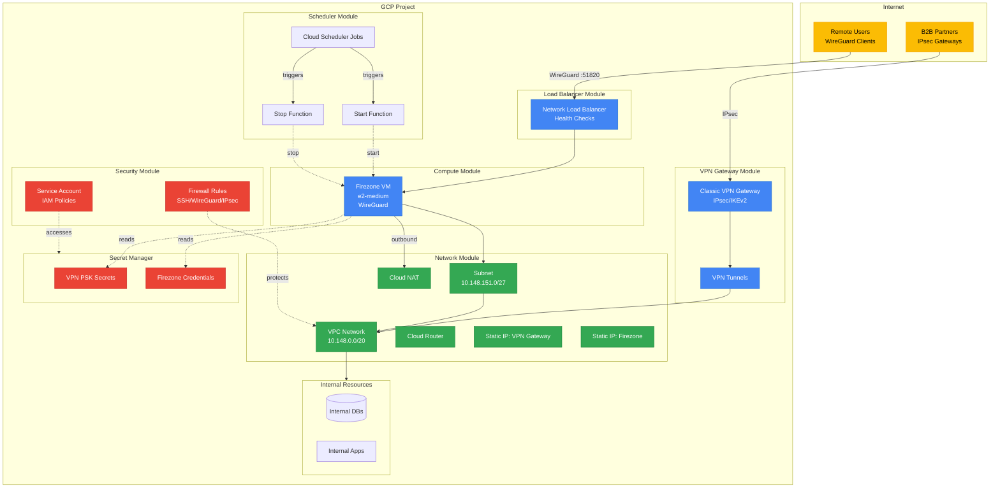

# terraform-gcp-vpn

<!-- Badges -->


Production-ready VPN infrastructure on Google Cloud with Terraform. (Current implementation: Firezone + WireGuard remote access, optional IPsec site-to-site.)

> For support, see [`SUPPORT.md`](SUPPORT.md).

## Features

- **Firezone VPN** - WireGuard-based remote access with Google Workspace SSO
- **IPsec Site-to-Site** - Classic VPN for B2B partner connectivity
- **Secret Management** - GCP Secret Manager integration for credentials
- **Auto Scheduling** - Optional cost optimization with automated start/stop
- **Zero Trust** - Identity-aware proxy, private VMs, defense-in-depth security

## Architecture



## Quick Start

### Prerequisites

- Terraform >= 1.0
- GCP Project with billing enabled
- `gcloud` CLI authenticated
- Google Workspace domain (for SSO)
- Service account for Terraform with `Editor` (or granular custom) access to create networking, compute, secret manager, and monitoring resources. Provide its JSON key via `GOOGLE_APPLICATION_CREDENTIALS` or `gcloud auth application-default login` before running Terraform.

### Basic Deployment

```bash
# Clone and configure
git clone https://github.com/dieguezz/terraform-gcp-vpn.git
cd terraform-gcp-vpn
cp terraform.tfvars.example terraform.tfvars

# Edit terraform.tfvars with your values
vim terraform.tfvars

# Deploy
terraform init
terraform plan
terraform apply
```

### Configuration

Key variables in `terraform.tfvars`:

```hcl
project_id              = "your-gcp-project"
region                  = "europe-southwest1"
firezone_domain         = "vpn.yourcompany.com"
google_workspace_domain = "yourcompany.com"
enable_site_to_site_vpn = true  # For B2B partners
```

See `terraform.tfvars.example` for all available options.

## Modules

| Module | Purpose |
|--------|---------|
| [network](modules/network/) | VPC, subnets, Cloud NAT, static IPs |
| [compute](modules/compute/) | Firezone VM instance |
| [security](modules/security/) | Firewall rules and IAM policies |
| [load-balancer](modules/load-balancer/) | Network Load Balancer for Firezone |
| [vpn-gateway](modules/vpn-gateway/) | IPsec Site-to-Site VPN Gateway |
| [scheduler](modules/scheduler/) | Automated VM start/stop scheduling |

## Secret Management

VPN secrets (preshared keys, etc.) are stored in **GCP Secret Manager**:

```bash
# Create a secret
echo -n "your-psk-value" | \
  gcloud secrets create vpn-psk-partner \
    --data-file=- \
    --replication-policy="automatic"

# Grant access to your team
gcloud secrets add-iam-policy-binding vpn-psk-partner \
  --member="group:devops@yourcompany.com" \
  --role="roles/secretmanager.secretAccessor"
```

Secrets are referenced in `secrets.tf` and never stored in git.

## Site-to-Site VPN Setup

### 1. Configure Partner Connection

Add to `terraform.tfvars`:

```hcl
enable_site_to_site_vpn = true

vpn_tunnels = {
  partner_name = {
    peer_name               = "Partner Network"
    peer_ip                 = "203.0.113.10"
    local_traffic_selector  = ["10.148.151.0/27"]
    remote_traffic_selector = ["192.0.2.0/24"]
  }
}
```

### 2. Create Secret for PSK

```bash
echo -n "preshared-key-from-partner" | \
  gcloud secrets create vpn-psk-partner \
    --data-file=- \
    --labels="vpn=partner,managed-by=terraform"
```

### 3. Reference Secret in Code

Add to `secrets.tf`:

```hcl
data "google_secret_manager_secret_version" "vpn_psk_partner" {
  secret  = "vpn-psk-partner"
  project = var.project_id
}
```

Update `main.tf`:

```hcl
module "vpn_gateway" {
  # ...
  vpn_secrets = {
    partner = data.google_secret_manager_secret_version.vpn_psk_partner.secret_data
  }
}
```

### 4. Deploy

```bash
terraform plan
terraform apply
```

### 5. Share IP with Partner

```bash
terraform output vpn_gateway_ip
```

See [modules/vpn-gateway/](modules/vpn-gateway/) for detailed documentation.

## Post-Deployment

### Firezone Setup

1. **Access Admin Panel**: `https://vpn.yourcompany.com`
2. **Initial Credentials**: Check VM startup logs or run `make credentials`
3. **Configure OAuth**:
   - Create OAuth client in Google Cloud Console
   - Add redirect URI: `https://vpn.yourcompany.com/auth/oidc/google/callback`
   - Configure in Firezone UI

### Verify VPN Tunnel

```bash
# Check tunnel status (pick a folder under scripts/site-to-site/)
make vpn-tunnel-status PARTNER=partner-template

Each partner has its own directory inside `scripts/site-to-site/`. Copy the
`partner-template` folder when onboarding a new connection and adjust the
defaults (tunnel name, region, etc.) before running the Makefile targets.
```

### Monitoring

```bash
# Instance status
make instance-status

# VPN tunnel logs
make vpn-logs

# Firezone logs (live)
make logs
```

## Cost Optimization

Enable auto-scheduling to reduce costs:

```hcl
enable_scheduling = true
scheduler_start_schedule = "0 7 * * 1-5"   # 7 AM Mon-Fri
scheduler_stop_schedule  = "0 20 * * 1-5"  # 8 PM Mon-Fri
scheduler_timezone       = "Europe/Madrid"
```

**Savings**: ~70% reduction in VM costs for non-production environments.

See [modules/scheduler/](modules/scheduler/) for details.

## Security

- ✅ **Private VMs** - No external IPs, IAP-only access
- ✅ **Secret Manager** - Credentials never in git
- ✅ **Least Privilege** - Minimal IAM permissions
- ✅ **Firewall Rules** - Explicit allow/deny policies
- ✅ **VPC Flow Logs** - Network traffic monitoring
- ✅ **OS Login** - Centralized SSH key management

## Troubleshooting

### VPN Tunnel Down

```bash
# Check IKE negotiations
gcloud logging read 'resource.type="vpn_gateway" severity="ERROR"' --limit=20

# Verify forwarding rules
gcloud compute forwarding-rules list --filter="name~vpn"

# Check firewall allows ESP/UDP
gcloud compute firewall-rules list --filter="name~vpn"
```

### Firezone Not Accessible

```bash
# Check VM is running
gcloud compute instances describe $(terraform output -raw instance_name)

# Verify load balancer health
gcloud compute backend-services get-health vpn-prod-backend-service \
  --region=europe-southwest1

# Check Docker containers (use Makefile command)
make ssh
# Then run: sudo docker compose -f /opt/firezone/docker-compose.yml ps
```

### Secret Access Denied

```bash
# Verify authentication
gcloud auth application-default login

# Check IAM permissions
gcloud secrets get-iam-policy vpn-psk-partner

# Test access
gcloud secrets versions access latest --secret="vpn-psk-partner"
```

## Maintenance

### Update Firezone

```bash
# SSH to VM (use Makefile command)
make ssh

# Update containers
cd /opt/firezone
sudo docker compose pull
sudo docker compose up -d
```

### Rotate VPN PSK

```bash
# Create new version of secret
echo -n "new-preshared-key" | \
  gcloud secrets versions add vpn-psk-partner --data-file=-

# Coordinate with partner to update their side
# Terraform will automatically use latest version
```

### Add New VPN Partner

1. Add tunnel config to `terraform.tfvars`
2. Create secret in Secret Manager
3. Reference secret in `secrets.tf` and `main.tf`
4. Run `terraform apply`
5. Share IP with partner: `terraform output vpn_gateway_ip`

## Incident Response & Alert Testing

### Incident Response Playbook

- **Acknowledge** the alert in Cloud Monitoring and grab the policy name / incident link.
- **Identify** the failing component using the Makefile helpers (`make instance-status`, `make vpn-tunnel-status PARTNER=<name>`) and relevant `gcloud` describe commands.
- **Mitigate** following the Troubleshooting guides above (restart Firezone, re-authenticate to Secret Manager, review firewall routes, etc.).
- **Document** the timeline, root cause, and remediation in your incident tracker before closing the alert.
- **Review** Terraform drift (`terraform plan`) once the incident is resolved to ensure the desired state still matches reality.

### Common Scenarios

- **Firezone outage**: confirm VM is running, restart the Docker stack, re-run health checks, and verify OAuth login works end-to-end.
- **VPN tunnel degraded**: run the partner-specific verifier, inspect gateway logs, confirm preshared key versions, and coordinate with the partner before declaring the tunnel healthy.
- **Secret access failures**: validate IAM bindings, rotate secrets if necessary, and rerun the automation that consumed the secret to ensure recovery.

### Alert Testing

- **Notification channels**: find the channel ID and send a test message.

  ```bash
  CHANNEL_ID=$(gcloud beta monitoring channels list --filter='displayName="Ops Email"' --format='value(name)')
  gcloud alpha monitoring channels send-test-notification "$CHANNEL_ID" --description="VPN stack sanity check"
  ```

- **Policy evaluation**: lower thresholds temporarily (for non-production) or stop the Firezone instance (`make stop-instance`) to trigger VM and uptime alerts; restore service and confirm the alert closes automatically.
- **Runbook validation**: after every significant change (Terraform, scripts), schedule a simulated incident and capture learnings in the Incident Response section or team wiki.

## References

### Official Documentation

- [Terraform GCP Provider](https://registry.terraform.io/providers/hashicorp/google/latest/docs)
- [GCP VPN Documentation](https://cloud.google.com/network-connectivity/docs/vpn)
- [GCP Secret Manager](https://cloud.google.com/secret-manager/docs)
- [Firezone Documentation](https://www.firezone.dev/docs)
- [GCP Compute Engine](https://cloud.google.com/compute/docs)
- [GCP Cloud Scheduler](https://cloud.google.com/scheduler/docs)
- [Terraform Best Practices](https://www.terraform.io/docs/cloud/guides/recommended-practices/index.html)

### Useful Tools

- [gcloud CLI Reference](https://cloud.google.com/sdk/gcloud/reference)
- [Terraform Registry](https://registry.terraform.io/)
- [CIDR Calculator](https://cidr.xyz/)
- [IPsec VPN Configuration Guide](https://cloud.google.com/network-connectivity/docs/vpn/how-to/creating-static-vpns)

## Contributing

Contributions are welcome! See `CONTRIBUTING.md` for guidelines.

## License

See `LICENSE` for details.

---

Maintained by [@dieguezz](https://github.com/dieguezz).
