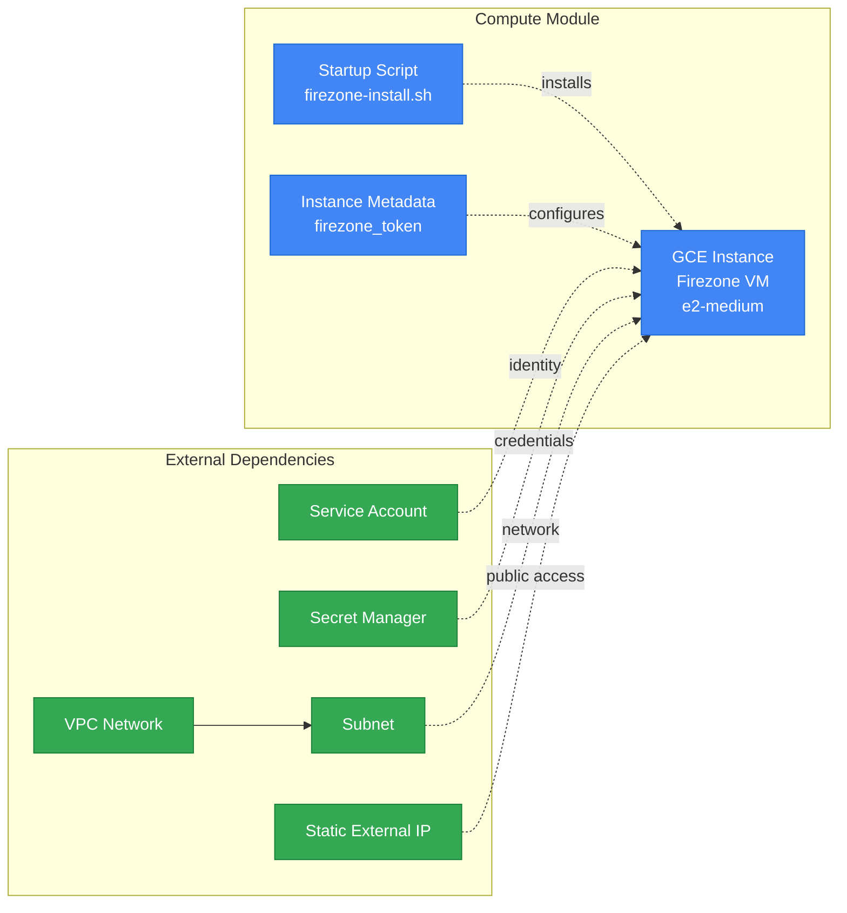

# Compute Module

## Overview
Creates and configures the Firezone VPN server VM instance with WireGuard support. Handles instance setup, metadata configuration, and startup script execution.

## Architecture

## Resources Created
- **GCE Instance**: Firezone VPN server (e2-medium)
- **Startup Script**: Automated Firezone installation and configuration
- **Service Account Binding**: IAM permissions for Secret Manager access

## Key Inputs
- `instance_name`: VM instance name
- `machine_type`: Instance size (default: e2-medium)
- `zone`: GCP zone for deployment
- `network_id`: VPC network ID
- `subnet_id`: Subnet ID for instance
- `external_ip`: Static external IP address
- `service_account_email`: Service account for instance
- `firezone_token`: Installation token for Firezone
- `secret_id`: Secret Manager secret ID for credentials

## Key Outputs
- `instance_id`: VM instance identifier
- `instance_name`: VM instance name
- `internal_ip`: Private IP address
- `external_ip`: Public IP address

## References

- [GCP Compute Engine Documentation](https://cloud.google.com/compute/docs)
- [Terraform google_compute_instance](https://registry.terraform.io/providers/hashicorp/google/latest/docs/resources/compute_instance)
- [Firezone Installation Guide](https://www.firezone.dev/docs/deploy)
- [GCP Secret Manager Access](https://cloud.google.com/secret-manager/docs/access-control)
