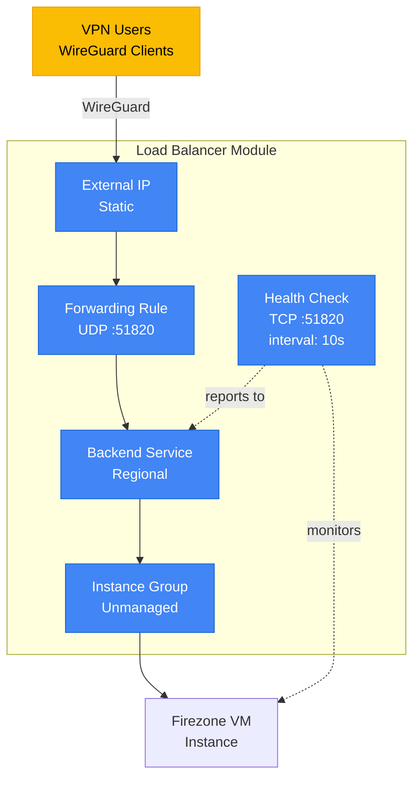

# Load Balancer Module

## Overview
Configures a Network Load Balancer (NLB) for the Firezone VPN server. Provides high availability, health checks, and stable external access endpoint.

## Architecture

## Resources Created
- **Health Check**: TCP health check on port 51820 (WireGuard)
- **Backend Service**: Regional backend service with instance group
- **Forwarding Rule**: External IP forwarding to backend
- **Instance Group**: Unmanaged instance group for VM

## Key Inputs
- `project_id`: GCP project ID
- `region`: GCP region
- `lb_name`: Load balancer name prefix
- `instance_id`: Firezone VM instance ID
- `external_ip`: Static external IP address
- `zone`: GCP zone for instance group

## Key Outputs
- `lb_ip_address`: Load balancer external IP
- `backend_service_id`: Backend service identifier
- `health_check_id`: Health check identifier

## References

- [GCP Network Load Balancer](https://cloud.google.com/load-balancing/docs/network)
- [Terraform google_compute_forwarding_rule](https://registry.terraform.io/providers/hashicorp/google/latest/docs/resources/compute_forwarding_rule)
- [Terraform google_compute_backend_service](https://registry.terraform.io/providers/hashicorp/google/latest/docs/resources/compute_region_backend_service)
- [Health Check Configuration](https://cloud.google.com/load-balancing/docs/health-checks)
