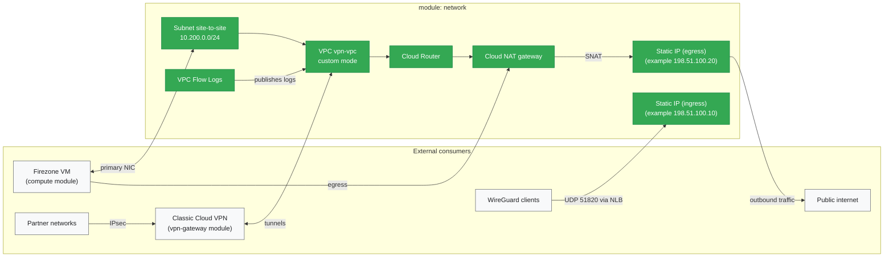

# Network Module

## Overview
Creates the foundational network infrastructure for the VPN setup. Provisions VPC, subnets, Cloud NAT, Cloud Router, and static IP addresses.

## Architecture

## Resources Created
- **VPC Network**: Custom VPC for VPN infrastructure
- **Subnet**: Regional subnet with private IP range
- **Cloud Router**: BGP router for dynamic routing
- **Cloud NAT**: Outbound internet access for private instances
- **Static IPs**: External IPs for VPN gateway and Firezone

## Key Inputs
- `project_id`: GCP project ID
- `region`: GCP region
- `network_name`: VPC network name
- `subnet_name`: Subnet name
- `subnet_cidr`: IP range for subnet (CIDR notation)
- `nat_name`: Cloud NAT name
- `router_name`: Cloud Router name

## Key Outputs
- `network_id`: VPC network identifier
- `network_name`: VPC network name
- `subnet_id`: Subnet identifier
- `vpn_gateway_ip`: Static IP for VPN gateway
- `firezone_ip`: Static IP for Firezone instance
- `router_name`: Cloud Router name

## References

- [GCP VPC Networks](https://cloud.google.com/vpc/docs/vpc)
- [Terraform google_compute_network](https://registry.terraform.io/providers/hashicorp/google/latest/docs/resources/compute_network)
- [Cloud NAT Documentation](https://cloud.google.com/nat/docs/overview)
- [Cloud Router Documentation](https://cloud.google.com/network-connectivity/docs/router)
- [Static IP Addresses](https://cloud.google.com/compute/docs/ip-addresses/reserve-static-external-ip-address)
