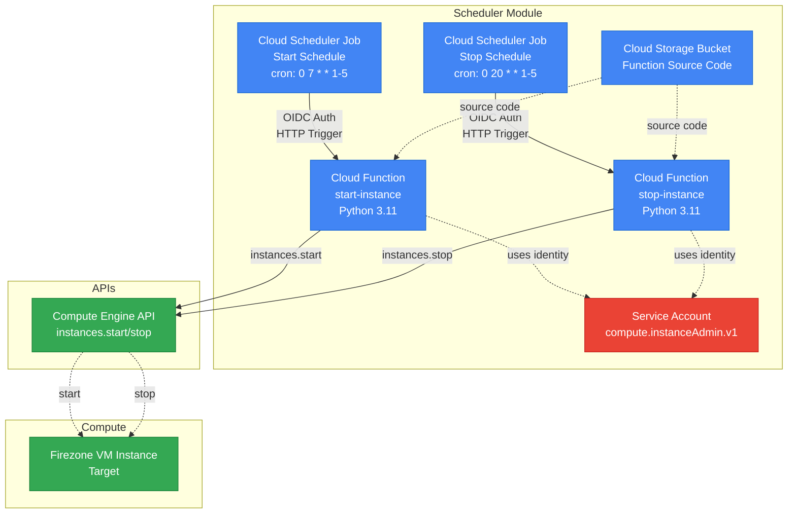

# ⏰ Scheduler Module

Automated start/stop scheduling for GCP Compute instances to reduce infrastructure costs.

## 📋 Overview

This module creates Cloud Scheduler jobs and lightweight Cloud Functions to automatically start and stop a VM instance on a configurable schedule. Perfect for development environments or business-hours-only workloads.

## Architecture Diagram



## 🎯 Features

- ✅ **Automated scheduling** - Set it and forget it
- ✅ **Configurable cron schedules** - Full flexibility
- ✅ **Timezone support** - Use your local timezone
- ✅ **Minimal permissions** - Service account with least privilege
- ✅ **Lightweight functions** - < 128 MB memory usage
- ✅ **Idempotent operations** - Safe to retry
- ✅ **Detailed logging** - Track all start/stop events

## 🏗️ Architecture

```
Cloud Scheduler (europe-west1)
    │
    ├─> Start Job (cron: "0 7 * * 1-5")
    │   └─> Cloud Function (HTTP)
    │       └─> Compute Engine API (start instance)
    │
    └─> Stop Job (cron: "0 20 * * 1-5")
        └─> Cloud Function (HTTP)
            └─> Compute Engine API (stop instance)
```

## 📦 Resources Created

| Resource | Purpose |
|----------|---------|
| `google_service_account` | Service account for Cloud Functions |
| `google_project_iam_member` | Permission to start/stop instances |
| `google_service_account_iam_member` | Permission to create OIDC tokens |
| `google_storage_bucket` | Storage for Cloud Function source code |
| `google_cloudfunctions2_function` × 2 | Start and stop functions |
| `google_cloud_run_service_iam_member` × 2 | Invoker permissions |
| `google_cloud_scheduler_job` × 2 | Scheduled triggers |

## 🔧 Usage

```hcl
module "scheduler" {
  source = "./modules/scheduler"

  project_id      = "my-project"
  region          = "europe-southwest1"
  zone            = "europe-southwest1-a"
  instance_name   = "my-instance"
  
  enable_scheduling = true
  start_schedule    = "0 7 * * 1-5"    # 7 AM Mon-Fri
  stop_schedule     = "0 20 * * 1-5"   # 8 PM Mon-Fri
  schedule_timezone = "Europe/Madrid"
  
  resource_prefix = "my-app"
  common_labels   = {
    environment = "production"
    managed_by  = "terraform"
  }
}
```

## 📊 Inputs

| Name | Description | Type | Default | Required |
|------|-------------|------|---------|----------|
| `project_id` | GCP project ID | `string` | - | yes |
| `region` | GCP region for regional resources (Load Balancer, NAT, etc.). Cloud Functions will be deployed here. | `string` | - | yes |
| `zone` | GCP zone where the VM instance is located (must be within `region`) | `string` | - | yes |
| `scheduler_region` | **INDEPENDENT** GCP region for Cloud Scheduler jobs. Cloud Scheduler has limited region support - see [valid regions](https://cloud.google.com/scheduler/docs/locations). Can differ from `region`. | `string` | `"europe-west1"` | no |
| `instance_name` | Name of the VM instance to schedule | `string` | - | yes |
| `enable_scheduling` | Enable automatic start/stop scheduling | `bool` | `true` | no |
| `start_schedule` | Cron expression for starting the instance | `string` | `"0 7 * * 1-5"` | no |
| `stop_schedule` | Cron expression for stopping the instance | `string` | `"0 20 * * 1-5"` | no |
| `schedule_timezone` | Timezone for the schedule (IANA format) | `string` | `"Europe/Madrid"` | no |
| `resource_prefix` | Prefix for scheduler resources | `string` | `"vpn-scheduler"` | no |

## 📤 Outputs

| Name | Description |
|------|-------------|
| `service_account_email` | Email of the scheduler service account |
| `start_schedule` | Configured start schedule |
| `stop_schedule` | Configured stop schedule |
| `schedule_timezone` | Configured timezone |
| `start_function_url` | URL of the start Cloud Function |
| `stop_function_url` | URL of the stop Cloud Function |

## 🕐 Cron Schedule Format

```
 ┌─────────── minute (0 - 59)
 │ ┌───────── hour (0 - 23)
 │ │ ┌─────── day of month (1 - 31)
 │ │ │ ┌───── month (1 - 12)
 │ │ │ │ ┌─── day of week (0 - 6) (Sunday = 0)
 │ │ │ │ │
 * * * * *
```

### Examples

| Schedule | Description |
|----------|-------------|
| `0 7 * * 1-5` | 7:00 AM, Monday through Friday |
| `0 20 * * 1-5` | 8:00 PM, Monday through Friday |
| `30 8 * * 1-5` | 8:30 AM, Monday through Friday |
| `0 18 * * *` | 6:00 PM, every day |
| `0 9 * * 1,3,5` | 9:00 AM, Monday, Wednesday, Friday |

## 🌍 Supported Timezones

Use IANA timezone format (e.g., `Europe/Madrid`, `America/New_York`, `Asia/Tokyo`).

See full list: https://en.wikipedia.org/wiki/List_of_tz_database_time_zones

## 🔍 Monitoring

### Check Scheduler Jobs

```bash
# List all jobs
gcloud scheduler jobs list --location=europe-west1

# Describe a specific job
gcloud scheduler jobs describe vpn-prod-start-job --location=europe-west1

# Run a job manually for testing
gcloud scheduler jobs run vpn-prod-start-job --location=europe-west1
```

### View Execution Logs

```bash
# Cloud Scheduler execution logs
gcloud logging read "resource.type=cloud_scheduler_job AND resource.labels.job_id=vpn-prod-start-job" --limit=10

# Cloud Function logs
gcloud functions logs read vpn-prod-start --region=europe-southwest1 --limit=20
gcloud functions logs read vpn-prod-stop --region=europe-southwest1 --limit=20
```

## 💡 Best Practices

1. **Test schedules** - Run jobs manually first to verify they work
2. **Monitor executions** - Check logs regularly for the first week
3. **Use retry policies** - Cloud Scheduler has built-in retry (already configured)
4. **Timezone awareness** - Remember daylight saving time changes
5. **Cost tracking** - Monitor actual savings vs. scheduler costs

## 🔒 Security

- **Minimal permissions** - Service account only has `roles/compute.instanceAdmin.v1`
- **OIDC authentication** - Secure token-based auth between Scheduler and Functions
- **No credentials** - Functions use Application Default Credentials
- **Audit trail** - All operations are logged in Cloud Logging

## 💰 Cost Considerations

| Service | Monthly Cost (approx.) |
|---------|------------------------|
| Cloud Scheduler (2 jobs) | ~$0.20 |
| Cloud Functions (2 functions, ~60 calls/month) | ~$0.10 |
| Cloud Storage (function source) | < $0.01 |
| **Total** | **~$0.31/month** |

Compare this to the savings from stopping a VM outside business hours! 🎯

## 🐛 Troubleshooting

### Job fails with 403 Permission Denied

Check that the service account has the correct permissions:
```bash
gcloud projects get-iam-policy PROJECT_ID \
  --flatten="bindings[].members" \
  --filter="bindings.members:vpn-prod-sa@*.iam.gserviceaccount.com"
```

### Function times out

Increase the timeout in `variables.tf`:
```hcl
variable "function_timeout" {
  default = 120  # seconds
}
```

### Instance doesn't start/stop

Check the instance status:
```bash
gcloud compute instances describe INSTANCE_NAME --zone=ZONE --format="get(status)"
```

## 📚 References

- [Cloud Scheduler Documentation](https://cloud.google.com/scheduler/docs)
- [Cloud Functions Gen2 Documentation](https://cloud.google.com/functions/docs/2nd-gen)
- [Compute Engine API Reference](https://cloud.google.com/compute/docs/reference/rest/v1/instances)
- [Cron Expression Guide](https://cloud.google.com/scheduler/docs/configuring/cron-job-schedules)
