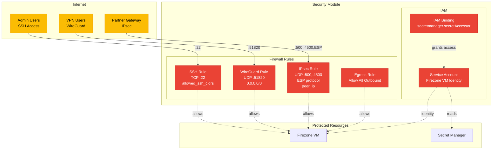

# Security Module

## Overview
Manages firewall rules and IAM policies for the VPN infrastructure. Controls network access, defines security perimeter, and grants necessary permissions.

## Architecture

## Resources Created
- **Firewall Rules**: Ingress/egress rules for VPN, WireGuard, and management
- **Service Account**: Identity for Firezone VM instance
- **IAM Bindings**: Secret Manager access permissions

## Key Inputs
- `project_id`: GCP project ID
- `network_name`: VPC network name
- `subnet_cidr`: Subnet IP range for internal rules
- `allowed_ssh_cidrs`: IP ranges allowed for SSH access
- `vpn_peer_ip`: Partner VPN gateway IP for IPsec
- `service_account_name`: Service account identifier

## Key Outputs
- `service_account_email`: Service account email address
- `firewall_rule_ids`: List of created firewall rule IDs

## Security Notes
- Restrict `allowed_ssh_cidrs` to trusted IP ranges only
- VPN peer IP is whitelisted for IPsec (UDP 500, 4500, ESP)
- WireGuard port 51820 exposed for remote access VPN

## References

- [GCP Firewall Rules](https://cloud.google.com/firewall/docs/firewalls)
- [Terraform google_compute_firewall](https://registry.terraform.io/providers/hashicorp/google/latest/docs/resources/compute_firewall)
- [GCP IAM Documentation](https://cloud.google.com/iam/docs)
- [Terraform google_service_account](https://registry.terraform.io/providers/hashicorp/google/latest/docs/resources/google_service_account)
- [VPC Firewall Best Practices](https://cloud.google.com/vpc/docs/firewalls#best_practices)
