# VPN Gateway Module

Classic IPsec Site-to-Site VPN Gateway for B2B partner connectivity.

## Overview

This module creates a Classic VPN Gateway in GCP for establishing secure IPsec tunnels with external partners. Uses policy-based routing (static traffic selectors) without BGP.

## Architecture

```mermaid
graph LR
    subgraph Partner Side
        PartnerGW[Partner VPN Gateway<br/>IPsec/IKEv2]
        PartnerNet[Partner Network<br/>192.0.2.0/24]
    end
    
    Internet((Internet))
    
    subgraph VPN Gateway Module
        IP[Static IP<br/>External]
        Gateway[VPN Gateway<br/>Classic VPN]
        FwdESP[Forwarding Rule<br/>ESP Protocol]
        FwdUDP500[Forwarding Rule<br/>UDP :500 IKE]
        FwdUDP4500[Forwarding Rule<br/>UDP :4500 NAT-T]
        Tunnel[VPN Tunnel<br/>IKEv2<br/>AES-256-CBC<br/>SHA2-256]
        Route[Static Route<br/>to Partner Network]
        PSK[Secret Manager<br/>Preshared Key]
    end
    
    subgraph GCP Network
        VPC[VPC Network]
        LocalNet[Local Network<br/>10.148.151.0/27]
        InternalRes[Internal Resources]
    end
    
    PartnerNet -.->|encrypted| PartnerGW
    PartnerGW <-->|IPsec| Internet
    Internet <--> IP
    IP --> FwdESP
    IP --> FwdUDP500
    IP --> FwdUDP4500
    FwdESP --> Gateway
    FwdUDP500 --> Gateway
    FwdUDP4500 --> Gateway
    Gateway --> Tunnel
    Tunnel <-.->|uses| PSK
    Tunnel --> Route
    Route --> VPC
    VPC --> LocalNet
    LocalNet --> InternalRes
    
    classDef vpnResource fill:#4285f4,stroke:#1967d2,color:#fff
    classDef securityResource fill:#ea4335,stroke:#c5221f,color:#fff
    classDef networkResource fill:#34a853,stroke:#188038,color:#fff
    classDef externalResource fill:#fbbc04,stroke:#f29900,color:#000
    
    class Gateway,Tunnel,FwdESP,FwdUDP500,FwdUDP4500,IP vpnResource
    class PSK securityResource
    class VPC,LocalNet,Route networkResource
    class PartnerGW,PartnerNet externalResource
```



## Features

- **Classic VPN** - Policy-based routing (no BGP required)
- **IKEv2/IPsec** - Industry standard encryption
- **Multi-tunnel** - Support multiple partner connections
- **Static Routes** - Automatic route creation
- **Firewall Integration** - Per-partner access control

## IPsec Configuration

| Parameter | Value |
|-----------|-------|
| **IKE Version** | IKEv2 |
| **Authentication** | Preshared Key (from Secret Manager) |
| **Phase 1 Encryption** | AES-256-CBC |
| **Phase 1 Hash** | SHA2-256 |
| **Phase 1 DH Group** | 14 (2048-bit) |
| **Phase 1 Lifetime** | 36000s |
| **Phase 2 Encryption** | AES-256-CBC |
| **Phase 2 Hash** | SHA2-256 |
| **Phase 2 PFS** | Group 14 |
| **Phase 2 Lifetime** | 3600s |
| **NAT Traversal** | Enabled |

## Resources Created

| Resource | Count | Purpose |
|----------|-------|---------|
| Static IP | 1 | VPN Gateway external IP |
| VPN Gateway | 1 | Classic VPN Gateway |
| Forwarding Rules | 3 | ESP, UDP/500, UDP/4500 protocols |
| VPN Tunnels | 1 per partner | IPsec tunnels |
| Routes | 1 per remote network | Static routing |
| Firewall Rules | 2 per partner | Inbound/outbound traffic |

## Usage

### Basic Configuration

```hcl
module "vpn_gateway" {
  source = "./modules/vpn-gateway"

  resource_prefix = "vpn"
  environment     = "prod"
  region          = "europe-southwest1"
  network_id      = module.network.vpc_id

  vpn_tunnels = {
    partner = {
      peer_name               = "Partner Network"
      peer_ip                 = "203.0.113.10"
      local_traffic_selector  = ["10.148.151.0/27"]
      remote_traffic_selector = ["192.0.2.0/24"]
    }
  }

  # Pass secrets from Secret Manager
  vpn_secrets = {
    partner = data.google_secret_manager_secret_version.vpn_psk_partner.secret_data
  }
}
```

### Multiple Partners

```hcl
vpn_tunnels = {
  partner_a = {
    peer_name               = "Partner A"
    peer_ip                 = "203.0.113.10"
    local_traffic_selector  = ["10.148.151.0/27"]
    remote_traffic_selector = ["192.0.2.0/24"]
  }
  
  partner_b = {
    peer_name               = "Partner B"
    peer_ip                 = "198.51.100.5"
    local_traffic_selector  = ["10.148.151.0/27"]
    remote_traffic_selector = ["198.18.0.0/16"]
  }
}

vpn_secrets = {
  partner_a = data.google_secret_manager_secret_version.vpn_psk_partner_a.secret_data
  partner_b = data.google_secret_manager_secret_version.vpn_psk_partner_b.secret_data
}
```

## Inputs

| Name | Type | Required | Description |
|------|------|----------|-------------|
| `resource_prefix` | string | Yes | Prefix for resource naming |
| `environment` | string | Yes | Environment (prod, dev, staging) |
| `region` | string | Yes | GCP region for VPN Gateway |
| `network_id` | string | Yes | VPC network self-link |
| `vpn_tunnels` | map(object) | No | Tunnel configurations (see example) |
| `vpn_secrets` | map(string) | No | PSK values from Secret Manager |
| `common_labels` | map(string) | No | Labels to apply to all resources |

## Outputs

| Name | Description |
|------|-------------|
| `gateway_id` | VPN Gateway resource ID |
| `gateway_ip` | Static IP of VPN Gateway (share with partner) |
| `tunnel_ids` | Map of tunnel names to resource IDs |
| `tunnel_status` | Map of tunnel names to current status |

## Verification

### Check Tunnel Status

```bash
# View tunnel status
gcloud compute vpn-tunnels describe vpn-tunnel-<partner> \
  --region=<region> \
  --format="value(status)"
# Expected output: ESTABLISHED

# Detailed status
gcloud compute vpn-tunnels list --format="table(name,status,peerIp,detailedStatus)"
```

### Verify Routes

```bash
# List VPN routes
gcloud compute routes list --filter="name~vpn" \
  --format="table(name,destRange,nextHopVpnTunnel)"
```

### Monitor Logs

```bash
# Tunnel logs
gcloud logging read "resource.type=vpn_tunnel" \
  --limit=50 \
  --format=json

# Filter by specific tunnel
gcloud logging read "resource.type=vpn_tunnel AND resource.labels.tunnel_name=vpn-tunnel-partner"
```

## Traffic Selectors

Traffic selectors define which networks can communicate through the tunnel:

- **`local_traffic_selector`** - Local networks (GCP side) that partner can access
- **`remote_traffic_selector`** - Remote networks (partner side) that GCP can access

**Important**: Traffic selectors must match exactly on both sides.

### Example

```hcl
local_traffic_selector  = ["10.148.151.0/27"]  # Our VPN subnet
remote_traffic_selector = ["192.0.2.0/24"]     # Partner's network
```

## Troubleshooting

### Tunnel Status is DOWN

**Checklist:**
1. Verify peer IP is correct
2. Confirm preshared key matches (check Secret Manager)
3. Ensure firewall allows ESP and UDP 500/4500
4. Review IKE logs: `gcloud logging read 'resource.type="vpn_gateway" severity="ERROR"'`

### No Traffic Flowing

**Checklist:**
1. Verify traffic selectors match on both sides
2. Check routes exist: `gcloud compute routes list --filter="name~vpn"`
3. Verify firewall rules allow traffic
4. Test from VM in correct subnet (must be in `local_traffic_selector`)

### IKE Negotiation Fails

```bash
# Check IKE logs
gcloud logging read 'resource.type="vpn_gateway"' --limit=20

# Common issues:
# - PSK mismatch
# - Incompatible encryption/hash algorithms
# - Firewall blocking UDP 500/4500
# - Incorrect peer IP
```

## Security Best Practices

- ✅ Store PSKs in GCP Secret Manager (never in git)
- ✅ Use strong PSKs (minimum 32 characters)
- ✅ Rotate PSKs periodically (coordinate with partner)
- ✅ Minimize traffic selectors to required networks only
- ✅ Enable VPC Flow Logs for monitoring
- ✅ Use separate tunnels for different security zones

## References

- [GCP Classic VPN Documentation](https://cloud.google.com/network-connectivity/docs/vpn/concepts/classic-vpn)
- [IPsec Configuration](https://cloud.google.com/network-connectivity/docs/vpn/how-to/creating-static-vpns)
- [Terraform google_compute_vpn_gateway](https://registry.terraform.io/providers/hashicorp/google/latest/docs/resources/compute_vpn_gateway)
- [Terraform google_compute_vpn_tunnel](https://registry.terraform.io/providers/hashicorp/google/latest/docs/resources/compute_vpn_tunnel)
- [VPN Troubleshooting Guide](https://cloud.google.com/network-connectivity/docs/vpn/support/troubleshooting)
- [IKEv2 Configuration Parameters](https://cloud.google.com/network-connectivity/docs/vpn/concepts/supported-ike-ciphers)
